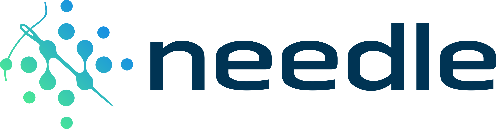
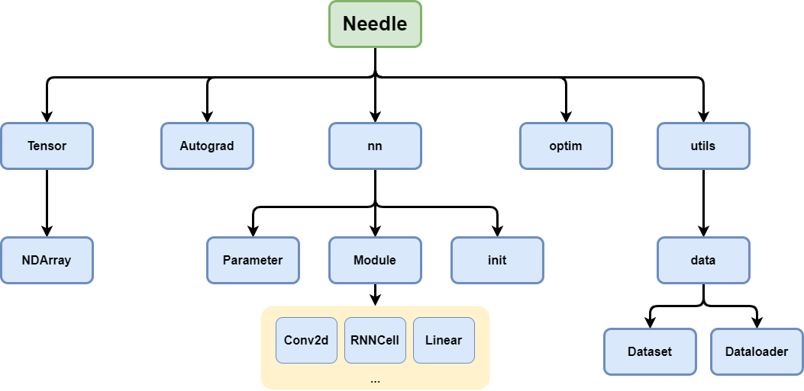
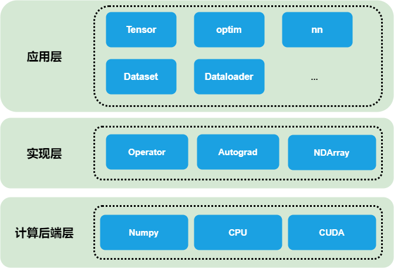
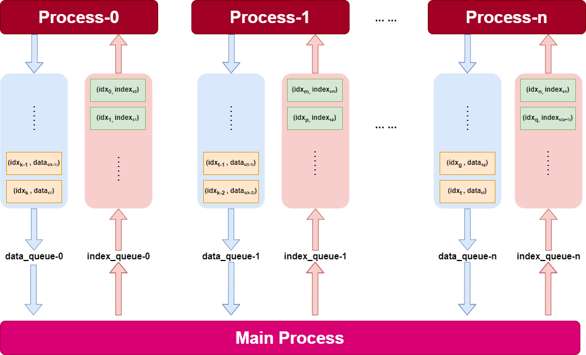

# `NEEDLE:` <u>Ne</u>cessary <u>E</u>lements of <u>D</u>eep <u>L</u>earning

Needle是一个微型的深度学习框架，是一个由  [CMU 10-414/714](https://dlsyscourse.org/)  课程而提出的实验性质的框架。该深度学习框架具备一个深度学习框架所需的基本要素，比如：以CPU和CUDA为后端的**张量运算**，**动态计算图**，模块化的**神经网络编程组件**，**自动微分工具**，经典模型实现等等。该repo为笔者学习该课程时的个人实现，以供参考，同时也方便笔者在更深入地学习机器学习系统的相关知识后在此基础上作进一步的开发。

## 安装

- TO DO

## Quick Start

​	因为Needle具备了一个深度学习框架所具备的基本特征，所以你可以使用该框架开发和训练自己的深度学习网络。可以查看`apps/`目录下的文件，笔者实现了一些经典的深度学习网络，以下的示例可以帮助你更快的了解Needle的使用：

* 在Penn Treebank Dataset上训练 RNN 或 LSTM 网络
* 在Cifar-10 Dataset上训练 ResNet-9 网络

## 目录

-  `apps/`：经典网络实现和训练代码
- `data/`: 数据集存放的文件夹
- `python/`
        |__ `needle/`
                     |__ `backend/`: 定义了具有一般性的 `NDArray` 类，规定了数据存取方式，支持不同类型的后端计算设备，比如numpy, native CPU, CUDA等。
                     |__ `utils/`: 包含Dataset和Dataloader代码
        |__ `autograd.py`: 定义了基本的动态计算图框架和自动微分框架
        |__ `init.py`: 深度学习中常见的参数初始化
        |__ `nn.py`: 模块化的神经网络库，提供了高层次的神经网络抽象
        |__ `ops.py`: 各类可自动求导的算子实现
        |__ `optim.py`: 神经网络优化器实现
- `src/`: Needle中Tensor的硬件加速后端代码，包括native CPU 和 CUDA
- `tests/`: 测试文件

## Needle内部机制

- #### **结构图**

  类似于 PyTorch, 以下几种编程模块用户使用 Needle 时可直接感知：Tensor, Autograd, nn, optim, Dataset 和 Dataloader。
  

  * **Tensor**：多维数组计算张量，是一个便捷、高效的数据结构，用来存储神经网络计算过程中的中间数据，构成动态计算图中的节点。该多维数组由 NDArray 类逻辑实现，NDArray 类使得所有操作数组结构的逻辑可以由 Python 语言编写，只有真正"底层"的运算才需要编写 C++ 代码操作底部的连续内存。
  * **Autograd**：自动求导工具，采用反向微分机制。
  * **nn**：神经网络模块抽象。提供灵活的编程接口，包含了深度学习中常用的一些基础神经网络层。
  * **optim**：深度学习优化算法库。
  * **utils**：深度学习网络训练过程中的效率工具。包括数据集抽象 Dataset 和数据集加载抽象 Dataloader，支持多进程加载，提升训练效率。
- #### **架构图**

  Needle具有灵活的编程模型和编程接口，且具有比较高效且可拓展的计算能力。笔者将Needle的架构分为三层：应用层，实现层和计算后端层，如下图所示。
  

  * **应用层**：是系统面向用户的前端，主要提供灵活的编程接口来供使用者表达深度学习模型。该层具有许多常见的深度学习中常见的组件，比如：`Tensor` 是 Needle 的基本数据结构，是框架中用来进行运算的多维数组；`optim` 是深度学习中用到的优化算法库，比如Adam和SGD等等；`nn` 是建立在自动求导系统上的神经网络库，包含了深度学习中常用的一些基础神经网络层；`Dataset`主要功能是创建和保存数据集，并提供了常见数据集的封装，如 MNIST, Cifar-10等；`Dataloader` 为数据集提供了按Batch的加载方法，并且能够使用多进程读取数据。
  * **实现层**：是 Needle 的核心层，向上提供自动微分，动态图构建等必要的组件让应用层调用，向下支持不同计算后端的计算。`Operator` 是可自动求导算子库，定义了神经网络常见算子的前向计算和反向传播，比如 Conv, Summation, Matmul 等等；`Autograd` 为自动微分系统实现，使用反向自动微分机制获取计算图中每个节点的梯度；`NDArray` 是一个数组类，根据底层后端的不同，可以通过不同方法开辟一个存储中的连续区域，然后再根据 shape, strides, offset 等参数将其转换成一个逻辑上的多维数组，该模块可以向上屏蔽不同计算后端的具体实现细节，向下在运行时根据参数调用相应的计算后端。
  * **计算后端层**：基于CPU或GPU，对常见的运算根据硬件特性进行加速，比如 Element-Wise 运算, 矩阵乘法等。目前支持 Numpy, native CPU, CUDA 三种常见的计算加速后端。

## 特性

- #### **张量加速后端**

  Needle提供了 Numpy, native CPU, CUDA 作为张量计算后端。通过抽象出 `NDArray` 类，来使 Needle 高效方便地进行 Tensor 相关的操作。`NDArray` 主要有`shape`, `strides`, `offset`, `device`, `handle` 等参数。Needle 将 `Tensor` 的数据存储在类似于`float * data[size]` 的一维数组中，该一维数组由`NDArray` 的`handle` 管理，使用 `shape`, `strides`, `offset`参数可以将计算后端中一段连续的内存映射成为多维数组，完成元素逻辑空间向物理存储空间的映射，大量的 transpose, broadcast, reshape 等操作能够通过操作这些参数来达到；同时一些原始的计算操作，比如 matrix multiply, element-wise operation, reduce max 等，则在底层由后端设备的计算语言实现，通过`device` 参数调用具体的计算设备进行计算。针对 matrix multiply 这种计算密集型算子，Needle利用矩阵分块和向量化等技巧进行加速，发挥CPU和CUDA多核的计算优势。

  

- #### 动态计算图

  Needle 支持 Python 命令式编程范式，按照 Python 语言描述模型结构，按照计算依赖关系进行调度执行，动态生成有向无环的计算图拓扑结构。Needle 框架构建的动态图中 `Operator` 作为节点，`Tensor` 作为节点间的有向线段。`Tensor` 类中通过op和inputs描述计算图中的依赖关系，即 self.op.compute(inputs) 实现运算。同时Needle支持懒汉模式，当Tensor被使用时才会真正完成运算。

* #### 自动微分系统

  Needle 使用反向自动微分机制构建来求解计算图中Tensor的梯度。具体来说，当你调用 `loss.backward()` 时，Needle 会找到动态计算图的拓扑排序，并从后往前根据链式求导法则求出各个Tensor的梯度。每个 op 都定义了前向计算的`compute` 方法和求解梯度的`gradient` 方法，当计算到某个 Tensor 的梯度时，依次利用链式求导法则和全微分法则将部分导数值累加到当前梯度上。
  

* #### 模块化神经网络组件

  Needle 同样提供了具有高层接口的神经网络库，该库中包含了基本的深度学习组件。在**模型表达方面**每个 `nn.Module` 遵循 “tensor in, tensor out” 的准则，这样一个模块的输入就可以当作另一个模块的输出，进一步组合形成复杂的神经网络。同时，对于**损失函数**和**优化方法**，Needle 也提供了相应模块，便于开发者快速迭代和验证模型。Needle 模块化的神经网络组件如下图。

  

* #### 多进程数据加载器

  为了避免在加载数据时阻塞计算代码，Needle 提供了数据集加载抽象 `Dataloader`，可指定 `num_workers ` 参数选择指定数量的进程进行数据加载。`Dataloader` 基于 `multiprocessing` 库产生多进程，每个子进程的输入队列`index_queue` 和输出队列`data_queue` 为`multiprocessing.Queue()`类。`index_queue` 的项为每个子进程的队列中需要处理的任务的下标，`data_queue` 的项为处理完的任务的下标。每个 worker 一次产生一个 batch 的数据，返回 batch 数据前放入下一个批次要处理的数据下标。dataloader 在初始化时便会向每个子进程的`index_queue` 放入`prefetch` 个下标，子进程从`index_queue` 中取出下标后便从数据集中取出和处理相应的batch，处理完毕后放入`data_queue` 。当用户在主进程外部调用next(dataloader)时，主进程便会取出加载完毕的batch，然后查询当前仍然active的进程，向对应的`index_queue` 放入需要处理的任务下标。这样，多进程的 dataloader 就能通过多个 Process 的协作来共同完成数据的加载。

  

  

* #### 经典神经网络实现

  Needle 提供了一些经典的神经网络实现，比如 MLP, ResNet-9, RNN, LSTM, Cycle-GAN (TO-DO), transformer (TO-DO)等等，供用户直接调用。

## 致谢

感谢 [陈天奇教授 ](https://tqchen.com/)和 [Zico Kolter](https://zicokolter.com/) 教授，以及所有的TA为这门课做出的贡献。也感谢 [dlsys 论坛](https://forum.dlsyscourse.org/) 的同学们的讨论与答疑解惑。

## 参考

1. [10-414/714: Deep Learning Systems ](https://dlsyscourse.org/)
2. [The forum of 10-414/714 ](https://forum.dlsyscourse.org/)
3. [《机器学习系统：设计和实现》](https://openmlsys.github.io/)
4. [知乎：PyTorch 源码解读之 torch.utils.data ](https://zhuanlan.zhihu.com/p/337850513)
5. [https://github.com/wzbitl/needle](https://github.com/wzbitl/needle)